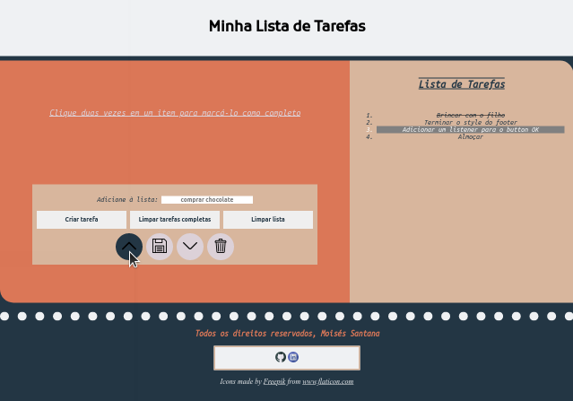

# Projeto To do List

To do List é um projeto idealizado pela Trybe onde temos como tarefa criar uma página web usando HTML5/CSS3/JavaScript, a página permite o cliente criar uma lista de tarefas, essa lista de tarefas tem as seguintes interações possíveis:

* Marcar tarefas como concluídas (dois cliques)
* Selecionar uma tarefa (clique)
* Limpar tarefas concluídas
* Limpar lista
* Subir uma tarefa selecionada
* Descer uma tarefa selecionada
* Salvar lista de tarefas (É salva no local storage)
* Excluir tarefa selecionada

O site foi projetado para um display de 1366 x 768!

## Técnologias utilizadas:

* HTML5
* CSS3
* JavaScript

### Para visualizar basta abrir o link:

https://moisessantana.github.io/to-do-list/
